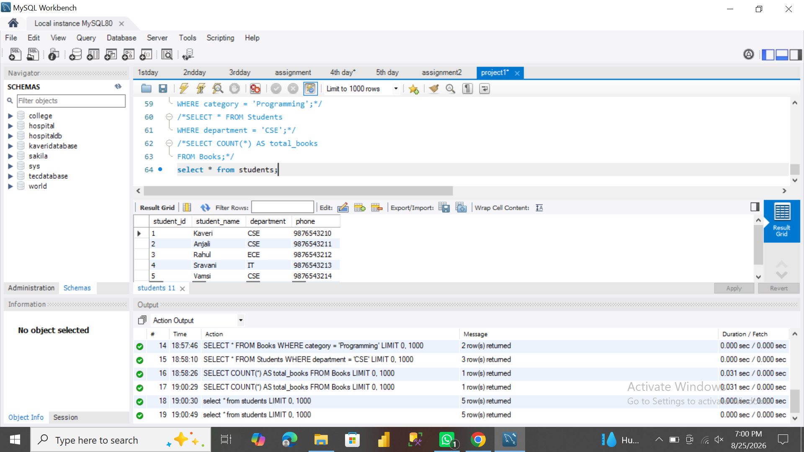
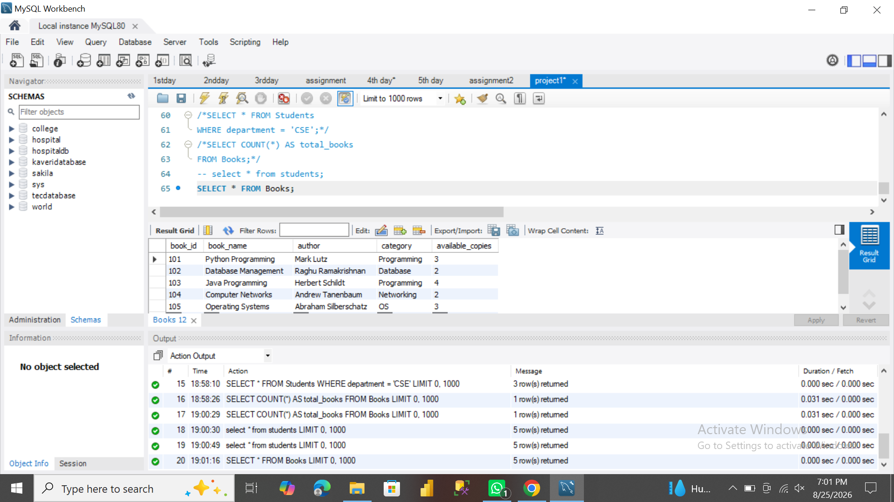
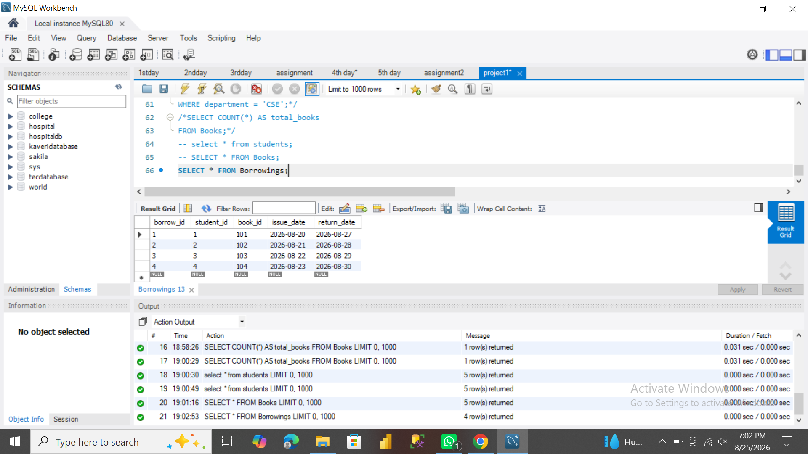
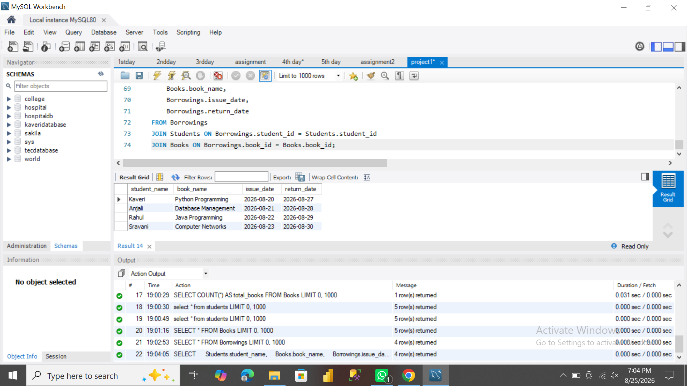

# Library Management Database

A SQL-based Library Management Database project developed using MySQL.

## Project Overview

This project manages library-related information such as students, books, borrowings, and their relationships using SQL.

## Features

- Student management
- Book management
- Book borrowing records
- SQL JOIN operations
- Database tables and relationships
- Query results for library management

## Database

- MySQL
- SQL

## Project File

- `library_management.sql` – Contains the database tables, data, and SQL queries.

## Screenshots

### Students Table

### Books Table

### Borrowings Table

### JOIN Query Result

## Project Structure

Library-Management-Database/
│
├── library_management.sql
├── README.md
└── screenshots/
    ├── students.png
    ├── books.png
    ├── borrowings.png
    └── join_result.png

## Author

Kaveri